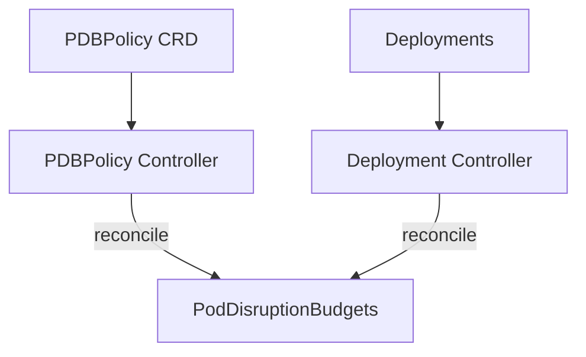

# PDB Operator

[](LICENSE)
[](go.mod)
[](https://github.com/pdb-operator/pdb-operator/actions/workflows/test.yml)
[](https://github.com/pdb-operator/pdb-operator/actions/workflows/lint.yml)

A Kubernetes operator that automates PodDisruptionBudget (PDB) management through policy-driven availability classes. Define your availability requirements declaratively and let the operator create, update, and reconcile PDBs across your cluster.

## Why PDB Operator?

Managing PodDisruptionBudgets at scale is painful. Teams forget to create them, set incorrect values, or leave stale PDBs behind. PDB Operator solves this by:

- **Policy-driven**: Define availability classes (`non-critical`, `standard`, `high-availability`, `mission-critical`) and the operator calculates the right PDB settings
- **Selector-based**: Target workloads by labels, names, functions, or namespaces
- **Enforcement modes**: Choose `strict`, `flexible`, or `advisory` enforcement per policy
- **Maintenance windows**: Automatically relax PDBs during scheduled maintenance
- **Workload-aware**: Security workloads get automatically boosted availability
- **Observable**: Built-in Prometheus metrics, OpenTelemetry tracing, structured logging, and Kubernetes events

## Architecture



The operator runs two controllers:

- **PDBPolicyController** - Watches `PDBPolicy` resources, finds matching deployments, and updates policy status
- **DeploymentController** - Watches `Deployment` resources, resolves the effective policy (considering annotations, enforcement modes, and priority), and creates/updates/deletes PDBs

## Quick Start

### Prerequisites

- Kubernetes 1.28+
- kubectl
- [cert-manager](https://cert-manager.io/) (for webhook TLS)

### Install

```sh
kubectl apply -f https://raw.githubusercontent.com/pdb-operator/pdb-operator/main/dist/install.yaml
```

### Create a Policy

```yaml
apiVersion: availability.pdboperator.io/v1alpha1
kind: PDBPolicy
metadata:
  name: production-ha
  namespace: default
spec:
  availabilityClass: high-availability
  enforcement: strict
  priority: 100
  workloadSelector:
    matchLabels:
      env: production
    namespaces:
      - default
      - production
  maintenanceWindows:
    - start: "02:00"
      end: "04:00"
      timezone: "UTC"
      daysOfWeek: [0, 6]  # Sunday, Saturday
```

This policy ensures all `env: production` deployments in the `default` and `production` namespaces get PDBs with 75% minimum availability, enforced strictly (annotations cannot override).

### Annotate Deployments (Optional)

For `advisory` and `flexible` enforcement modes, deployments can override the policy using annotations:

```yaml
apiVersion: apps/v1
kind: Deployment
metadata:
  name: my-service
  annotations:
    pdboperator.io/availability-class: "mission-critical"
    pdboperator.io/workload-function: "security"
    pdboperator.io/workload-name: "auth-service"
```

## Availability Classes

| Class | MinAvailable | Use Case |
|-------|-------------|----------|
| `non-critical` | 20% | Batch jobs, dev workloads |
| `standard` | 50% | General applications |
| `high-availability` | 75% | Production APIs, databases |
| `mission-critical` | 90% | Payment systems, auth services |
| `custom` | User-defined | Full control via `customPDBConfig` |

Security workloads (`pdboperator.io/workload-function: security`) are automatically boosted: `non-critical` becomes 50%, `standard` becomes 75%.

## Enforcement Modes

| Mode | Behavior |
|------|----------|
| `strict` | Policy cannot be overridden by annotations |
| `flexible` | Annotations can increase but never decrease availability below `minimumClass` |
| `advisory` | Annotations can freely override the policy (default) |

## Custom PDB Configuration

For fine-grained control, use `availabilityClass: custom` with `customPDBConfig`:

```yaml
spec:
  availabilityClass: custom
  customPDBConfig:
    minAvailable: "3"              # or maxUnavailable: "1"
    unhealthyPodEvictionPolicy: IfHealthyBudget
```

## Annotations Reference

### Deployment Annotations

| Annotation | Description |
|-----------|-------------|
| `pdboperator.io/availability-class` | Override availability class |
| `pdboperator.io/workload-function` | Workload function: `core`, `management`, `security` |
| `pdboperator.io/workload-name` | Explicit workload name for selector matching |
| `pdboperator.io/maintenance-window` | Override maintenance window (format: `HH:MM-HH:MM TZ`) |
| `pdboperator.io/override-reason` | Required when `overrideRequiresReason` is enabled |

### Managed PDB Labels

| Label | Description |
|-------|-------------|
| `pdboperator.io/managed-by` | Marks PDB as managed by pdb-operator |
| `pdboperator.io/workload` | References the protected workload |
| `pdboperator.io/availability-class` | Applied availability class |

## Observability

### Prometheus Metrics

| Metric | Type | Description |
|--------|------|-------------|
| `pdb_operator_reconciliation_duration_seconds` | Histogram | Reconciliation duration |
| `pdb_operator_reconciliation_errors_total` | Counter | Reconciliation errors |
| `pdb_operator_pdbs_created_total` | Counter | PDBs created |
| `pdb_operator_pdbs_updated_total` | Counter | PDBs updated |
| `pdb_operator_pdbs_deleted_total` | Counter | PDBs deleted |
| `pdb_operator_deployments_managed` | Gauge | Managed deployments per namespace/class |
| `pdb_operator_policies_active` | Gauge | Active policies per namespace |
| `pdb_operator_compliance_status` | Gauge | Deployment compliance status |
| `pdb_operator_maintenance_window_active` | Gauge | Maintenance window active |
| `pdb_operator_enforcement_decisions_total` | Counter | Enforcement decisions |
| `pdb_operator_override_attempts_total` | Counter | Override attempts |

### OpenTelemetry Tracing

Set `OTLP_ENDPOINT` or `JAEGER_ENDPOINT` environment variable to enable distributed tracing via OTLP protocol.

### Structured Logging

JSON-formatted structured logging with audit trails, correlation IDs, and trace context propagation.

## Development

### Prerequisites

- Go 1.26+
- Docker or Podman
- [operator-sdk](https://sdk.operatorframework.io/) v1.42+
- [cert-manager](https://cert-manager.io/)

### Build and Test

```sh
# Run tests
make test

# Run linter
make lint

# Build binary
make build

# Build container image
make docker-build IMG=ghcr.io/pdb-operator/pdb-operator:dev
```

### Local Development

```sh
# Install CRDs
make install

# Run controller locally
make run

# Deploy to cluster
make deploy IMG=ghcr.io/pdb-operator/pdb-operator:dev
```

### Uninstall

```sh
kubectl delete -k config/samples/
make uninstall
make undeploy
```

## Troubleshooting

### PDBs not being created

1. Check the operator logs:
   ```sh
   kubectl logs -n pdb-operator-system deployment/pdb-operator-controller-manager
   ```
2. Verify the policy matches your deployment:
   ```sh
   kubectl get pdbpolicy -A -o wide
   kubectl get pdb -A -l pdboperator.io/managed-by=pdb-operator
   ```
3. Check policy status for matching workloads:
   ```sh
   kubectl describe pdbpolicy <name>
   ```

### Webhook errors

1. Verify cert-manager is running and the certificate is ready:
   ```sh
   kubectl get certificate -n pdb-operator-system
   ```
2. Check webhook configuration:
   ```sh
   kubectl get validatingwebhookconfiguration,mutatingwebhookconfiguration | grep pdb
   ```

### Policy conflicts

When multiple policies match a deployment, the operator uses priority-based resolution. Check which policy was applied:

```sh
kubectl get deployment <name> -o jsonpath='{.metadata.annotations}'
kubectl get events --field-selector involvedObject.name=<name>
```

### Metrics not showing

1. Verify the metrics service is running:
   ```sh
   kubectl get svc -n pdb-operator-system | grep metrics
   ```
2. Check ServiceMonitor is picked up by Prometheus:
   ```sh
   kubectl get servicemonitor -n pdb-operator-system
   ```

For more help, open an [issue](https://github.com/pdb-operator/pdb-operator/issues).

## Contributing

We welcome contributions! Please see [CONTRIBUTING.md](CONTRIBUTING.md) for guidelines.

This project uses the [Developer Certificate of Origin (DCO)](https://developercertificate.org/). All commits must be signed off:

```sh
git commit -s -m "feat: add new feature"
```

## Community

- [Code of Conduct](CODE_OF_CONDUCT.md)
- [Governance](GOVERNANCE.md)
- [Security Policy](SECURITY.md)
- [Maintainers](MAINTAINERS.md)
- [Roadmap](ROADMAP.md)
- [Changelog](CHANGELOG.md)

## License

Copyright 2025 The PDB Operator Authors.

Licensed under the Apache License, Version 2.0. See [LICENSE](LICENSE) for details.
