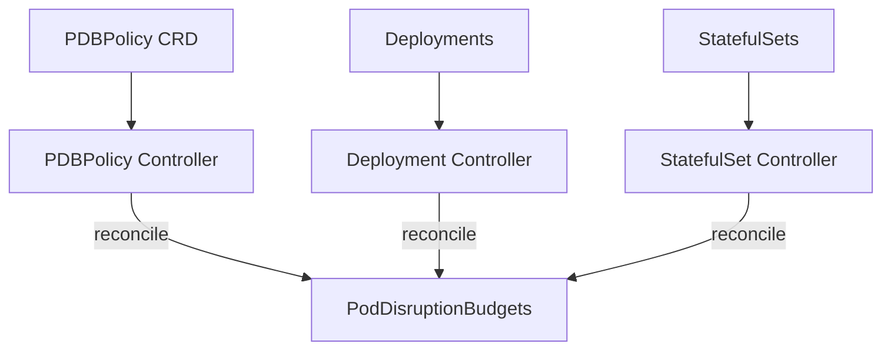

# PDB Operator

<p align="center">
  <strong>
    <a href="#quick-start">Getting Started</a>
    &nbsp;&nbsp;&bull;&nbsp;&nbsp;
    <a href="CONTRIBUTING.md">Contributing</a>
    &nbsp;&nbsp;&bull;&nbsp;&nbsp;
    <a href="https://cloud-native.slack.com/channels/pdb-operator">Get In Touch</a>
  </strong>
</p>

<p align="center">
  <a href="https://github.com/pdb-operator/pdb-operator/actions/workflows/test.yml?query=branch%3Amain">
    
  </a>
  <a href="https://github.com/pdb-operator/pdb-operator/actions/workflows/lint.yml?query=branch%3Amain">
    
  </a>
  <a href="https://github.com/pdb-operator/pdb-operator/releases">
    
  </a>
  <a href="LICENSE">
    
  </a>
</p>

---

A Kubernetes operator that automates PodDisruptionBudget (PDB) management through policy-driven availability classes. Define your availability requirements declaratively and let the operator create, update, and reconcile PDBs across your cluster.

## Why PDB Operator?

Managing PodDisruptionBudgets at scale is painful. Teams forget to create them, set incorrect values, or leave stale PDBs behind. PDB Operator solves this by:

- **Policy-driven**: Define availability classes (`non-critical`, `standard`, `high-availability`, `mission-critical`, `custom`) and the operator calculates the right PDB settings
- **Selector-based**: Target workloads by labels, names, functions, or namespaces
- **Enforcement modes**: Choose `strict`, `flexible`, or `advisory` enforcement per policy
- **Maintenance windows**: Automatically relax PDBs during scheduled maintenance
- **Workload-aware**: Security workloads get automatically boosted availability
- **Self-cleaning**: PDBs are removed when a workload scales below 2 replicas and recreated when it scales back, so no stale PDBs are left behind
- **Observable**: Built-in Prometheus metrics, OpenTelemetry tracing, structured logging, and Kubernetes events

## Architecture


```mermaid
graph TD
    A[PDBPolicy CRD] --> B[PDBPolicy Controller]
    C[Deployments] --> D[Deployment Controller]
    F[StatefulSets] --> G[StatefulSet Controller]
    B -- reconcile --> E[PodDisruptionBudgets]
    D -- reconcile --> E
    G -- reconcile --> E
```

The operator runs three controllers:

- **PDBPolicyController** - Watches `PDBPolicy` resources, finds matching workloads, and updates policy status
- **DeploymentController** - Watches `Deployment` resources, resolves the effective policy (considering annotations, enforcement modes, and priority), and creates/updates/deletes PDBs
- **StatefulSetController** - Watches `StatefulSet` resources with the same policy-driven logic, enabling PDB protection for stateful workloads such as databases and message queues

## Quick Start

### Prerequisites

- Kubernetes 1.28+
- kubectl
- [cert-manager](https://cert-manager.io/) (for webhook TLS)

### Install

#### Helm (recommended)

The chart is published as an OCI artifact:

```sh
helm install pdb-operator oci://ghcr.io/pdb-operator/charts/pdb-operator \
  --version 0.2.3 \
  --namespace pdb-operator-system --create-namespace
```

On a cluster without cert-manager, disable the webhook and its certificate:

```sh
helm install pdb-operator oci://ghcr.io/pdb-operator/charts/pdb-operator \
  --version 0.2.3 \
  --namespace pdb-operator-system --create-namespace \
  --set webhooks.enabled=false --set certManager.enabled=false
```

See [helm-pdb-operator](https://github.com/pdb-operator/helm-pdb-operator) for all values.

#### Raw manifests

Generate a consolidated manifest from a checkout and apply it:

```sh
make build-installer IMG=ghcr.io/pdb-operator/pdb-operator:v0.2.2
kubectl apply -f dist/install.yaml
```

### Create a Policy

```yaml
apiVersion: availability.pdboperator.io/v1alpha1
kind: PDBPolicy
metadata:
  name: production-ha
  namespace: default
spec:
  availabilityClass: high-availability
  enforcement: strict
  priority: 100
  workloadSelector:
    matchLabels:
      env: production
    namespaces:
      - default
      - production
  maintenanceWindows:
    - start: "02:00"
      end: "04:00"
      timezone: "UTC"
      daysOfWeek: [0, 6]  # Sunday, Saturday
```

This policy ensures all `env: production` deployments in the `default` and `production` namespaces get PDBs with 75% minimum availability, enforced strictly (annotations cannot override).

### Annotate Workloads (Optional)

For `advisory` and `flexible` enforcement modes, workloads can override the policy using annotations:

```yaml
apiVersion: apps/v1
kind: Deployment
metadata:
  name: my-service
  annotations:
    pdboperator.io/availability-class: "mission-critical"
    pdboperator.io/workload-function: "security"
    pdboperator.io/workload-name: "auth-service"
```

StatefulSets are supported with the same annotations:

```yaml
apiVersion: apps/v1
kind: StatefulSet
metadata:
  name: mysql
  annotations:
    pdboperator.io/availability-class: "high-availability"
    pdboperator.io/workload-function: "core"
    pdboperator.io/workload-name: "mysql"
```

## Availability Classes

| Class | MinAvailable | Use Case |
|-------|-------------|----------|
| `non-critical` | 20% | Batch jobs, dev workloads |
| `standard` | 50% | General applications |
| `high-availability` | 75% | Production APIs, databases |
| `mission-critical` | 90% | Payment systems, auth services |
| `custom` | User-defined | Full control via `customPDBConfig` |

Security workloads (`pdboperator.io/workload-function: security`) are automatically boosted: `non-critical` becomes 50%, `standard` becomes 75%.

## Group-Aware PDBs for Multi-Host Inference (LeaderWorkerSet)

When the [LeaderWorkerSet](https://lws.sigs.k8s.io/) CRD (`leaderworkerset.x-k8s.io/v1`) is installed, the operator also manages PDBs for LWS workloads such as multi-host vLLM or SGLang deployments. Support is detected at startup; without the CRD the operator runs unchanged.

LWS groups restart as a unit (default `RecreateGroupOnPodRestart`): evicting one pod takes down all `size` pods of its group. A pod-counting percentage both under-protects capacity and can deadlock node drains, so the operator quantizes the budget to whole groups:

```
desiredGroups = ceil(class% x replicas), clamped to replicas - 1
minAvailable  = desiredGroups x size
```

For `replicas: 4, size: 8` under `mission-critical` (90%) this yields `minAvailable: 24`: exactly one group may be disrupted at a time, and a drain always makes progress. Granularity is whole groups, so a 4-group set has only 4 protection steps.

Special cases:

| Shape | Behavior |
|-------|----------|
| `replicas: 1` | No PDB is created (any budget would permanently block drains); a Warning event explains why |
| `size: 1` | Plain pod-level semantics, same as a Deployment |
| `custom` with absolute `minAvailable` | Rounded up to the next whole group |

The PDB selects on the `leaderworkerset.sigs.k8s.io/name` label, covering leader and worker pods. LWS implements each set as a leader StatefulSet plus per-group worker StatefulSets; the operator's StatefulSet controller skips those (same label) so pods never match more than one PDB, which would make the eviction API reject every eviction.

## Gang-Aware PDBs from the Workload API (Kubernetes 1.35+)

When the cluster serves the upstream Workload API (`scheduling.k8s.io/v1beta1`, [KEP-4671](https://github.com/kubernetes/enhancements/blob/master/keps/sig-scheduling/4671-gang-scheduling/README.md), beta in Kubernetes 1.37 behind the `GenericWorkload` feature gate), the operator also manages PDBs for gang-scheduled workloads declared through it. Support is detected at startup; without the API the operator runs unchanged. Upstream gang scheduling is placement-only, and `disruptionMode` is consumed only by scheduler preemption, so voluntary evictions (node drains) are otherwise unprotected.

| Declared shape | PDB behavior |
|----------------|--------------|
| `gang` policy with `disruptionMode: {all: {}}` | The group restarts as a unit, so the budget is quantized to whole pod groups (same math as LeaderWorkerSet) |
| `gang` policy with `disruptionMode: {single: {}}` (or unset) | Pod-level semantics with `minAvailable` floored at the gang `minCount` |
| Single all-mode group, or a `minCount` that leaves no pod evictable | No PDB; a Warning event explains why (any budget would permanently block drains) |
| Multiple gang templates or composite templates | Skipped for now, with a Warning event |

Pods reference their group via `spec.schedulingGroup.podGroupName`, which is not a label, so the PDB selector is derived from the labels common to the group's pods and validated to match exactly those pods. Until pods exist, or when no exact selector can be derived, no PDB is created and a Warning explains why. Pods already covered by a native gang path (the LWS label) are left to that path.

The availability class is resolved on the `Workload` object itself: `PDBPolicy` selectors match its labels, and the `pdboperator.io/*` annotations work the same as on any other workload.

## Enforcement Modes

| Mode | Behavior |
|------|----------|
| `strict` | Policy cannot be overridden by annotations |
| `flexible` | Annotations can increase but never decrease availability below `minimumClass` |
| `advisory` | Annotations can freely override the policy (default) |

## Custom PDB Configuration

For fine-grained control, use `availabilityClass: custom` with `customPDBConfig`:

```yaml
spec:
  availabilityClass: custom
  customPDBConfig:
    minAvailable: "3"              # or maxUnavailable: "1"
    unhealthyPodEvictionPolicy: IfHealthyBudget
```

## Annotations Reference

### Workload Annotations

| Annotation | Description |
|-----------|-------------|
| `pdboperator.io/availability-class` | Override availability class |
| `pdboperator.io/workload-function` | Workload function: `core`, `management`, `security` |
| `pdboperator.io/workload-name` | Explicit workload name for selector matching |
| `pdboperator.io/maintenance-window` | Override maintenance window (format: `HH:MM-HH:MM TZ`) |
| `pdboperator.io/override-reason` | Required when `overrideRequiresReason` is enabled |

### Managed PDB Labels

| Label | Description |
|-------|-------------|
| `pdboperator.io/managed-by` | Marks PDB as managed by pdb-operator |
| `pdboperator.io/workload` | References the protected workload |
| `pdboperator.io/availability-class` | Applied availability class |

## Observability

### Prometheus Metrics

| Metric | Type | Description |
|--------|------|-------------|
| `pdb_operator_reconciliation_duration_seconds` | Histogram | Reconciliation duration |
| `pdb_operator_reconciliation_errors_total` | Counter | Reconciliation errors |
| `pdb_operator_pdbs_created_total` | Counter | PDBs created |
| `pdb_operator_pdbs_updated_total` | Counter | PDBs updated |
| `pdb_operator_pdbs_deleted_total` | Counter | PDBs deleted |
| `pdb_operator_deployments_managed` | Gauge | Managed deployments per namespace/class |
| `pdb_operator_leaderworkersets_managed` | Gauge | Managed LeaderWorkerSets per namespace/class |
| `pdb_operator_workloads_managed` | Gauge | Managed scheduling.k8s.io Workloads per namespace/class |
| `pdb_operator_policies_active` | Gauge | Active policies per namespace |
| `pdb_operator_compliance_status` | Gauge | Deployment compliance status |
| `pdb_operator_maintenance_window_active` | Gauge | Maintenance window active |
| `pdb_operator_enforcement_decisions_total` | Counter | Enforcement decisions |
| `pdb_operator_override_attempts_total` | Counter | Override attempts |

### OpenTelemetry Tracing

Set `OTLP_ENDPOINT` environment variable to enable distributed tracing via OTLP/gRPC protocol.

### Structured Logging

JSON-formatted structured logging with audit trails, correlation IDs, and trace context propagation.

## Development

### Prerequisites

- Go 1.26+
- Docker or Podman
- [operator-sdk](https://sdk.operatorframework.io/) v1.42+
- [cert-manager](https://cert-manager.io/)

### Build and Test

```sh
# Run tests
make test

# Run linter
make lint

# Build binary
make build

# Build container image
make docker-build IMG=ghcr.io/pdb-operator/pdb-operator:dev
```

### Local Development

```sh
# Install CRDs
make install

# Run controller locally
make run

# Deploy to cluster
make deploy IMG=ghcr.io/pdb-operator/pdb-operator:dev
```

### Uninstall

```sh
kubectl delete -k config/samples/
make uninstall
make undeploy
```

## Troubleshooting

### PDBs not being created

1. Check the operator logs (deployment is `pdb-operator` for a Helm install, `pdb-operator-controller-manager` for the raw manifest):
   ```sh
   kubectl logs -n pdb-operator-system deployment/pdb-operator
   ```
2. Verify the policy matches your deployment:
   ```sh
   kubectl get pdbpolicy -A -o wide
   kubectl get pdb -A -l pdboperator.io/managed-by=pdb-operator
   ```
3. Check policy status for matching workloads:
   ```sh
   kubectl describe pdbpolicy <name>
   ```

### Webhook errors

1. Verify cert-manager is running and the certificate is ready:
   ```sh
   kubectl get certificate -n pdb-operator-system
   ```
2. Check webhook configuration:
   ```sh
   kubectl get validatingwebhookconfiguration,mutatingwebhookconfiguration | grep pdb
   ```

### Policy conflicts

When multiple policies match a workload, the operator uses priority-based resolution. Check which policy was applied:

```sh
kubectl get deployment,statefulset <name> -o jsonpath='{.metadata.annotations}'
kubectl get events --field-selector involvedObject.name=<name>
```

### "cannot set blockOwnerDeletion" on OpenShift

On clusters with the `OwnerReferencesPermissionEnforcement` admission plugin enabled (e.g. OpenShift), the operator needs `update` on the `deployments/finalizers` and `statefulsets/finalizers` subresources to set `blockOwnerDeletion` on managed PDBs. The Helm chart grants this. For a raw-manifest install, confirm the ClusterRole includes:

```sh
kubectl get clusterrole pdb-operator-manager-role -o yaml | grep finalizers
```

### Metrics not showing

1. Verify the metrics service is running:
   ```sh
   kubectl get svc -n pdb-operator-system | grep metrics
   ```
2. Check ServiceMonitor is picked up by Prometheus:
   ```sh
   kubectl get servicemonitor -n pdb-operator-system
   ```

For more help, open an [issue](https://github.com/pdb-operator/pdb-operator/issues).

## Contributing

We welcome contributions! Please see [CONTRIBUTING.md](CONTRIBUTING.md) for guidelines.

This project uses the [Developer Certificate of Origin (DCO)](https://developercertificate.org/). All commits must be signed off:

```sh
git commit -s -m "feat: add new feature"
```

## Community

- [CNCF Slack: #pdb-operator](https://cloud-native.slack.com/channels/pdb-operator)
- [Code of Conduct](CODE_OF_CONDUCT.md)
- [Governance](GOVERNANCE.md)
- [Security Policy](SECURITY.md)
- [Maintainers](MAINTAINERS.md)
- [Roadmap](ROADMAP.md)
- [Changelog](CHANGELOG.md)

## License

Copyright 2025-2026 The PDB Operator Authors.

Licensed under the Apache License, Version 2.0. See [LICENSE](LICENSE) for details.
